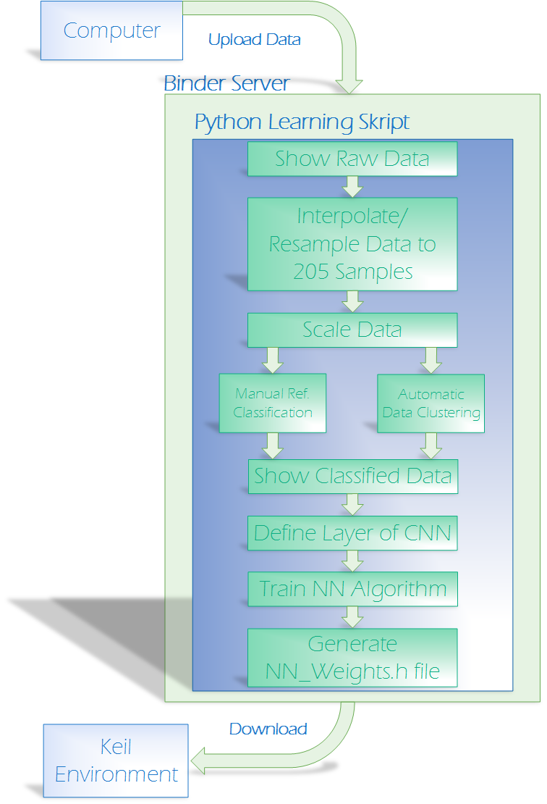

# Phänomen Detection Skript

The aim of this python script is to provide a simple, user-friendly and time-efficient solution for solving classification problems with a Neural Network (NN) library integrated in an Arm Cortex M4 Microcontroller (Infenion XMC 4700). Additionally the user has the ability to deploy the learned Keras NN weights by using an automatically generated interface header file written in the programming language C. This headerfile can be downloaded and integrated directly in a MCU Project environment by replacing a NN_weights.h file. The following Figure shows the schematic structure and workflow of the script.

